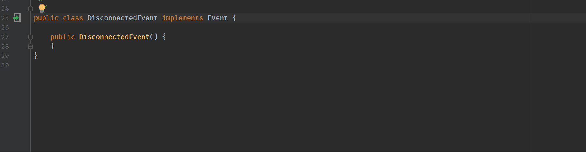

Terasology Developer Kit Plugin
==
This plugin is build to help developing with Terasology

## ToDo feature
### RelatedItemProvider
- [x] Finding handler function  
    - [ ] Separately marking possible handler ,and handler which will definitely receive the event   
    - [ ] Sorting by priority and mark the non default priority event in related item list
- [x] Goto event declarer from handler
- [ ] Finding Event possible Sender location  
    - [ ] Entity.send()  
    - [ ] Entity.saveComponent()  
    - [ ] Consider the entity build with prefab.(Need to search the prefab resource)  
- [ ] The code which create entity via prefab goto prefab file.
- [ ] Prefab to related Component
### Detect incorrect usage 
- [ ] Add a event handler to listen a event marked with @ServerEvent on client system
- [ ] Prefab that has a nonexisting Component class or invlid name
- [ ] Invalid event receive method parameter
- [ ] An unregistered ComponentSystem
### Template
- [ ] Event
    - [ ] Can select event type (server event ,etc.)
- [ ] Prefab
    - [ ] Can select extend parent
    - [ ] Can select components from existing
- [ ] Module (replace gradle command)
### AutoComplete
- [ ] Prefab finding existing Component class
- [ ] Prefab parent finding existing prefab

### Custom icon
- [ ] EventReceiver
- [ ] EvnetSender
- [ ] Prefab
- [ ] Component
### Other
- [x] Rebuild project into Gradle version 
- [ ] Integration with Jenkins

## Develop
### Requirement
- Kotlin plugin 
- Intellij Idea

clone and simply import as Gradle Project.
It will automatic download dependency and resource for a while.  

### Debug
For debug please use the `Plugin Debug` Configuration which will disable ProcessCanceledException.

### Build Plugin
Run the Gradle Task `BuildPlugin` ,then the plugin artifact will be generated under `build/distributions`

### Plugin SDK Document

For more detail please see [Official IntelliJ Platform Guide](http://www.jetbrains.org/intellij/sdk/docs/welcome.html)
and [intellij-sdk-docs](https://github.com/JetBrains/intellij-sdk-docs)

